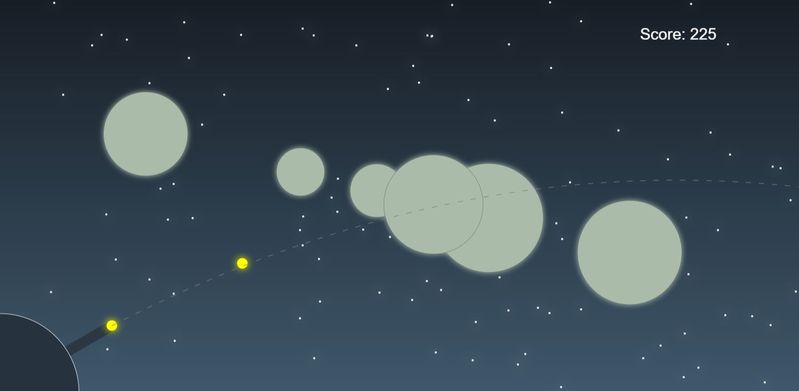
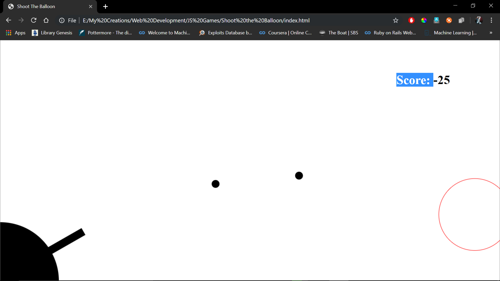

# Shoot The Balloons

"Shoot the balloons" is a HTML5 Canvas Game. It is built on HTML5, and JS. About the game? There's a gun, balloons fly in. You just have to aim and click to fire bullets. 

This works on most of the modern browser.
This game will only work on Desktops and Laptops. 

You can play the game here: [Click Here](https://rajivnayanc.github.io/Shoot_the_Balloons_HTML5_canvas/)

Enjoy! 

To see the game video: [Click Here](https://youtu.be/GfCtvOjVBes)

Here are some screenshots of the Game :

### Built with

* [HTML 5 Canvas](https://www.w3schools.com/html/html5_canvas.asp)

## Deployement
* Download the repository
* Open index.html in browser
* Done!

# About Me

You can check my other projects on:
* [Github](https://github.com/rajivnayanc)
* [LinkedIn](https://www.linkedin.com/in/rajivnayanc/)
